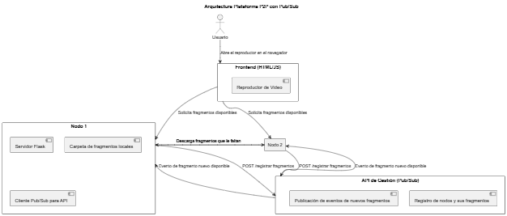

## Sistemas Distruibuido Proyecto Final
### Mini Plataforma de Streamin P2P con Microservicios

#### Objetivo General 

Conctruir un sistema distribuido que permita intercambiar fragmnetos de video de forma P2P. Los fragmentos se distribuyen en varios nodo, que pueden solicitarse mutuamente los archivos faltantes.


---
#### Diagrama de arquitectura

---




Esta comformado por api_gestion que es el que se encarga de simular el sitema Pub/Sub notifica todos los cambios, registros y cambios en los dos nodos, asi como a cual nodo ingresa el usario.

El nodo 1 y 2 tiene la misma composición en su archivo solo varia el puerto para que se pueda ejecutar de diferente puerto.

Cada archivo esta almacenado en una carpeta, cada nodo pose una carpeta donde contiene una parte de los fracmentos de video y una que contiene un archivo en HTML para su visualisación en el navegado.

El api_gestion.py es el API gestiona el sistema mantiene un registro de las actividades del sistema, simulando ser un modelo de Pub/SUb y mantiene comunicacion entre los nodo.

Este almacena la informacion de los fragmentos disponibles de cada nodo y notifia el origen de cada nodo, asi como el nombre del fragmento.

La funcion de los nodos es de la arquitectura P2P, cada nodo cumple los mismos roles al mismo tiempo, estos comparten sus fracmentos al mismo tiempo y los descargan desde el otro nodo, este muestra la lista de fragmentos que pose, envia los fracmentos que el otro necesite y recibe notificacion de recibido.
Ok, lo dejamos con un tono más relajado, como si lo hubieras escrito tú para explicarle a un compañero cómo correrlo.

---

## Cómo activar el sistema

1. **Primero corre el API**
   Arranca el archivo **`api_gestor.py`**.
   Este es como el “jefe de la orquesta”: se encarga de que los nodos sepan quién tiene qué fragmentos y les avisa cuando aparece uno nuevo.

2. **Luego levanta los nodos**
   Abre uno o los dos (**`nodo1.py`** y **`nodo2.py`**).
   Cuando se conectan:

   * Se registran en el API.
   * Se suscriben para que el API les avise cuando alguien tenga un fragmento nuevo.
   * Empiezan a pedir y compartir fragmentos entre ellos.

3. **Abre el navegador**
   Ve a **localhost** con el puerto de cualquiera de los nodos que hayas levantado, por ejemplo:

   ```
   http://127.0.0.1:5001
   ```

   o

   ```
   http://127.0.0.1:5002
   ```

4. **Y listo, a ver el video**
   El nodo que abras en el navegador te muestra el reproductor. Si le faltan fragmentos, se los pide a los otros nodos.
   En cuanto tiene todo lo que necesita, empieza a reproducir el video automáticamente.

---
Video de funcionamiento
https://drive.google.com/drive/folders/1EgjIFnIFq2QV6tdcPgH7JPGIsuWcArMz?usp=sharing